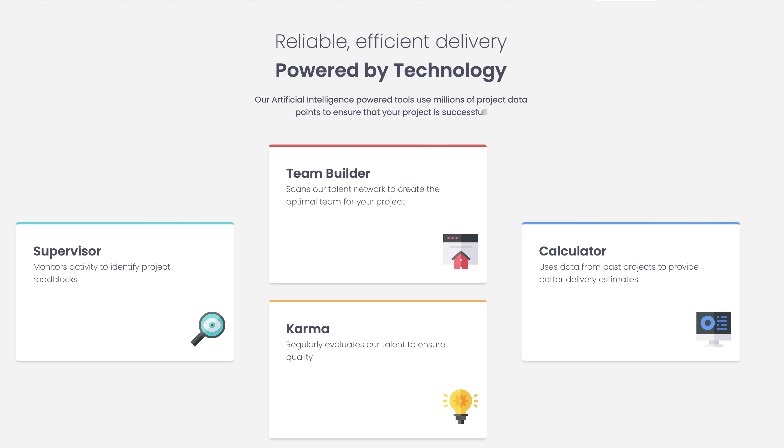

# Frontend Mentor - Four card feature section solution

This is a solution to the [Four card feature section challenge on Frontend Mentor](https://www.frontendmentor.io/challenges/four-card-feature-section-weK1eFYK). Frontend Mentor challenges help you improve your coding skills by building realistic projects. 

## Table of contents

- [Overview](#overview)
  - [The challenge](#the-challenge)
  - [Screenshot](#screenshot)
- [My process](#my-process)
  - [Built with](#built-with)
  - [What I learned](#what-i-learned)
  - [Continued development](#continued-development)

## Overview

### The challenge

Users should be able to:

- View the optimal layout for the site depending on their device's screen size

### Screenshot



## My process

### Built with

- Semantic HTML5 markup
- CSS custom properties
- CSS Grid
- Mobile-first workflow

### What I learned

- I learned that CSS Grid is a powerful layout system that allows for precise control over the placement and alignment of elements on a webpage. It helped me understand how to define grid areas, control column placement, and align elements more efficiently


```css
.#main{
    display: grid;
    grid-template-columns: repeat(3, 1fr) ;
    gap: 15px;
    margin-left: 2rem;
    margin-right: 2rem;
    grid-template-areas: ". b ." "a b d" "a c d" ". c .";
}
#main >:nth-child(1){
    grid-area: a;
}
#main >:nth-child(2){
    grid-area: b;
}
#main >:nth-child(3){
    grid-area: c;
}
#main >:nth-child(4){
    grid-area: d;
}
```


### Continued development

Going forward, I plan to continue practicing grid-based designs and deepen my understanding of when to use CSS Grid vs Flexbox for layout challenges.

